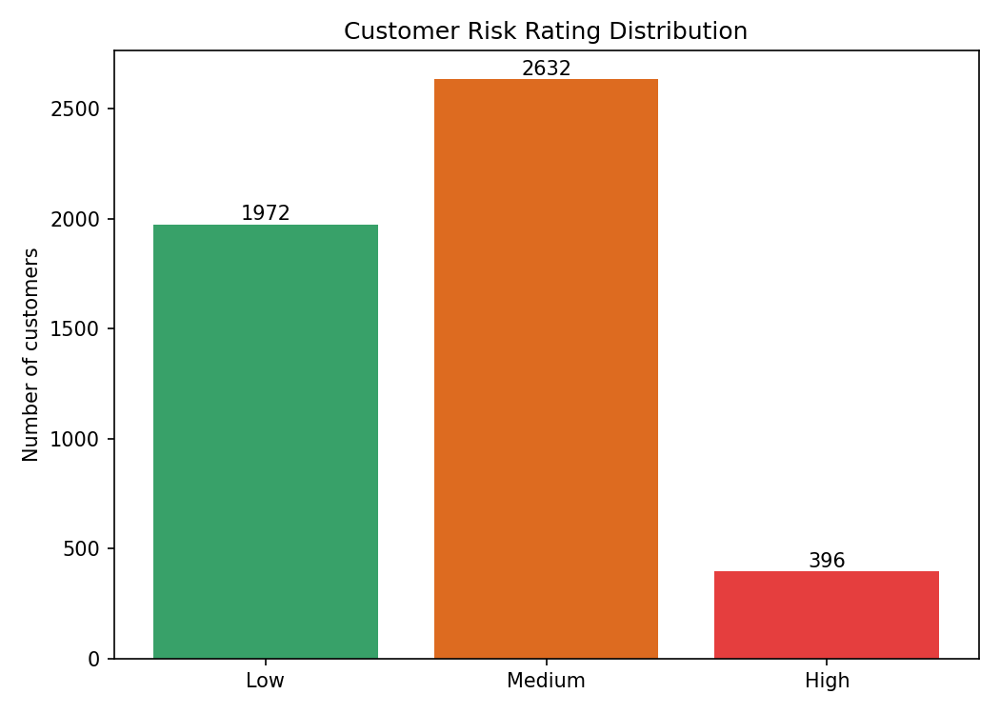

# 🕵️ KYC Customer Risk Analysis & Sanctions Screening

An end-to-end **Know Your Customer (KYC)** analytics project — risk-rating 5,000
customers, screening them against sanctions/PEP watchlists, and monitoring for
unusual activity. Built to mirror the daily work of a KYC / AML analyst.

## 📌 Overview

Financial institutions must assess how risky each customer is, screen them against
government watchlists, and monitor their behaviour over time. This project builds a
transparent, auditable **risk-rating engine**, runs **fuzzy-matched sanctions
screening**, and layers on **ongoing activity monitoring** — then visualises the
whole risk picture.

## 🧭 Business context

You cannot deeply investigate every customer, so a **risk-based approach** focuses
compliance effort where it matters. High-risk customers get Enhanced Due Diligence;
low-risk customers get simplified checks. Getting this wrong means either regulatory
fines (missed risk) or wasted resources and customer friction (over-flagging).

## 🔧 Tools & methods

- **Python** — pandas for scoring & aggregation, difflib for fuzzy name matching,
  matplotlib for visuals
- **Risk-rating engine** — a weighted, explainable points model across 8 risk factors
  (country, occupation, product, PEP status, adverse media, channel, source of funds, ID)
- **Sanctions/PEP screening** — fuzzy matching customer names to a watchlist to catch
  variant spellings, with threshold-based alerting
- **Ongoing monitoring** — flagging customers whose activity exceeds their expected profile

## 📈 Key findings

1. **Risk-based segmentation.** ~8% of customers rated **High** (needing EDD), ~53%
   Medium, ~39% Low — letting the business focus effort where risk concentrates.
2. **Risk is geographic.** High-risk customers cluster in Russia, Nigeria, India,
   Afghanistan, Iran and Panama — a mix of sanctioned and high-risk jurisdictions.
3. **Screening trades precision for recall — on purpose.** Fuzzy matching caught true
   variant spellings ("Ivan Petroff" → "Ivan Petrov"; "Yanukovich" → "Yanukovych")
   but also many false positives — reflecting the real analyst task of adjudicating alerts.
4. **Monitoring must be prioritised.** A simple activity-spike rule flags ~29% of the
   book; combining it with the risk rating shrinks that to a focused, actionable list.

## ✅ Recommendation

1. **Apply Enhanced Due Diligence** to the ~8% High-risk segment; automate simplified
   checks for Low-risk customers to save analyst time.
2. **Tune the screening threshold** to balance missed matches vs false-positive load,
   and route all alerts to human adjudication.
3. **Prioritise monitoring** on customers who are both high-risk and showing activity
   spikes — the most likely candidates for a Suspicious Activity Report (SAR).
4. **Keep the model explainable** — every rating is fully auditable, a regulatory must.

## 📂 Files

- `01-kyc.ipynb` — the full analysis
- `data/kyc_customers.csv` — 5,000 customer records
- `data/watchlist.csv` — sanctions/PEP watchlist (OFAC/UN/EU)
- `kyc_risk_summary.csv` — per-customer risk output
- chart PNGs — risk distribution, score histogram, geographic concentration

## 🔮 What I'd do next

- Add secondary matching (date of birth, nationality) to cut screening false positives.
- Build a Power BI monitoring dashboard on the summary output.
- Add network analysis to detect linked/related high-risk customers.

> *Note: uses an illustrative dataset built to demonstrate the KYC methodology; the
> same approach applies directly to real onboarding and screening data.*

---
*Part of my data analytics portfolio — [github.com/Ajiboye-Adegboyega-Luqman](https://github.com/Ajiboye-Adegboyega-Luqman)*
